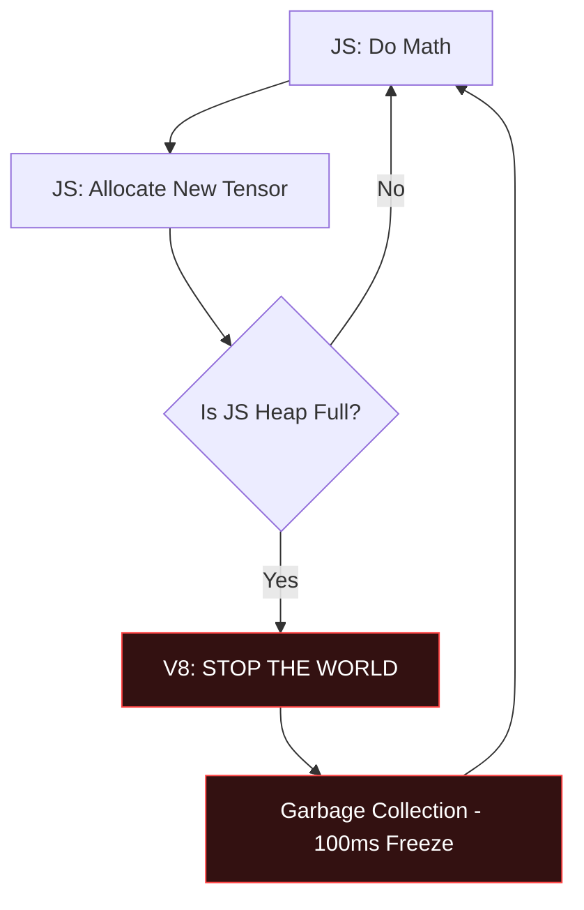
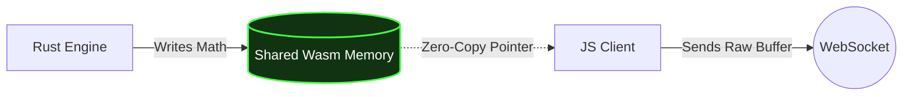
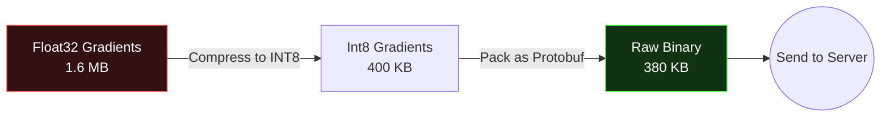

Training neural networks in the browser sounds like a terrible idea. 

When I first started building **FlockML**, it wasn't because I wanted to torture myself with browser constraints. It was born out of necessity. GPU clusters are prohibitively expensive—a handful of A100s can bankrupt a startup before it even ships. Yet, at the exact same time, millions of consumer devices—laptops, phones, tablets—sit idle while browsing the web, possessing gigaflops of untapped compute power. 

I had a crazy idea: what if I could crowdsource this compute from everyday website visitors to train AI models for exactly $0?

To pull that off, it had to be completely invisible, lightning-fast, and entirely browser-native. Here is the engineering journey of how FlockML went from a naïve prototype to a high-performance decentralized AI engine.

---

## Chapter 1: The JavaScript Tragedy

When I began building the first iteration of FlockML, I started where everyone starts: JavaScript. I used standard structures like `Float32Array` and wrote a basic Stochastic Gradient Descent (SGD) loop.

I immediately hit a wall. 

Legacy frameworks like TensorFlow.js often allocate new memory on the JavaScript heap for intermediate tensor states during matrix multiplications and gradient updates. In a training loop running thousands of epochs across a 400,000-parameter model, these constant allocations pile up instantly.

When the heap gets full, V8 (Chrome's JavaScript engine) stops the world. It triggers a massive, blocking garbage collection (GC) sweep. 

During my initial benchmarking, standard JIT array mapping was crawling at a miserable **36.0 ms per operation**. This meant that running a single batch of SGD would visibly stutter the browser tab, freezing animations and ruining the user experience. The JavaScript heap was melting under the pressure.

## Chapter 2: The Rust & Wasm Pivot

I realized quickly that I needed to bypass the JIT compiler entirely. I rewrote the core autograd engine and matrix math routines from scratch in Rust, compiling them directly to WebAssembly (`wasm32-unknown-unknown`). 

Rust gives me deterministic memory management. There is no garbage collector. When a tensor is dropped, its memory is freed immediately. But here’s the catch: simply moving the math to Wasm isn't enough if you're still copying giant arrays back and forth across the JS-Wasm boundary.

If you serialize an array in JS, pass it to Wasm, and Wasm returns a new array to JS, you are still triggering V8's garbage collector. 

The real breakthrough that saved the project was the **Zero-Copy Memory Handshake**.

### The Zero-Copy Handshake

WebAssembly operates on a linear memory model—essentially one giant, contiguous buffer of raw bytes. Instead of expensively passing arrays back and forth, FlockML shares this exact memory buffer with JavaScript.

1. **Wasm Linear Memory:** Rust allocates continuous 1D buffers for the backpropagation weights directly inside the WebAssembly block.
2. **Typed Array Pointers:** JavaScript never actually "gets" the array. It just holds a pointer. I instantiate an `Int8Array` *view* over the exact offset and length in the Wasm memory buffer.
3. **Instant Transmission:** That mapped buffer is passed directly to the WebSocket tunnel.

By interacting exclusively via typed views over Wasm memory, I entirely eliminated GC pauses. My mapping throughput plummeted from 36.0 ms to **under 1.0 ms per operation**—a **36x raw speedup**.

---

## Chapter 3: The Network Choke

With compute solved, I hit the next bottleneck: the network.

A standard `Float32` parameter takes 4 bytes. If a client trains a small 400,000-parameter model, the gradient update is 1.6 MB. If 1,000 visitors are training concurrently, they are trying to push 1.6 GB of gradient data to the servers every few seconds. This would saturate the clients' upload bandwidth and crash the ingest servers instantly.

To fix this, I implemented strict **8-Bit Quantization (INT8)** before anything goes over the wire.

Right before transmission, the Rust engine scales the 32-bit floats into 8-bit integers. These integers are then packed tightly into raw binary Protocol Buffers (Protobufs). This shrunk the network payload by over 90%, enabling zero-latency weight synchronization.

---

## Chapter 4: Securing the Swarm

When you crowdsource compute, you are processing data on untrusted client machines. If you send plain gradients back to the server, an adversary could theoretically analyze those gradients to reverse-engineer the original training data (a Model Inversion attack).

To guarantee privacy, FlockML injects **cryptographic Laplacian noise** directly into the gradients *before* they ever leave the browser. 

This guarantees **Differential Privacy**. Even if an attacker intercepts the WebSocket payload, they cannot isolate any individual user's data. Because the noise is zero-mean Laplacian, it cancels out when I aggregate thousands of gradients on the central server, allowing the global model to converge perfectly.

---

## Chapter 5: Today

The final piece of the puzzle was user experience. I built a dynamic profiler into the Web Worker. When a user visits a site running FlockML, it runs a silent 50ms benchmark to profile the device's hardware FLOPS, dynamically scaling the SGD batch sizes based on available headroom. If the user starts scrolling heavily, FlockML instantly yields execution back to the main thread.

Because I compiled to bare-metal WebAssembly and wrote my own hyper-minimal tensor engine in Rust, the entire FlockML core weighs in at just **38KB**. Compare that to ONNX Web (~5MB of C++ runtime) or TensorFlow.js (~30MB JS Heap overhead), and you begin to understand why FlockML is completely invisible to the end user.

---

## Chapter 6: The Future (What I'm Building Next)

With compute, network, and privacy solved for distributed training, the next frontier is natively running massive Foundation Models in the browser. Here is what is actively sitting in my uncommitted Git staging area for the future of FlockML:

### 1. WebGPU Compute Shaders (WGSL)
While WebAssembly is blazingly fast for CPU execution, true LLM inference requires VRAM. I am building a native **WebGPU Compute Engine** that offloads massive matrix multiplications (like Attention blocks) directly to the user's local GPU using WGSL compute shaders. It employs 2D workgroup grids (16x16) for parallel block processing, escaping the CPU entirely.

### 2. Local Gemma-2B Inference
I am currently stringing together raw WebAssembly AI primitives (SiLU, RMSNorm, RoPE) to construct the exact forward-pass architecture used by Google's **Gemma-2B LLM**. The goal is to allow anyone to drop a script tag into their website and instantly run a 2-Billion parameter language model natively in the visitor's browser, completely offline and with zero API costs.

### 3. Native HuggingFace Safetensors Support
To make the ecosystem truly plug-and-play, I am building native parsers for the **Safetensors** format. You will soon be able to point FlockML directly to a HuggingFace repository, download the compressed model weights securely, and inject them straight into the Wasm linear memory buffer without any Python intermediary.

I started with a crazy idea to decentralize AI infrastructure. Today, I've turned the browser into a high-performance, secure, and privacy-preserving compute node.

*FlockML v1.3.0 is officially live on NPM.*
